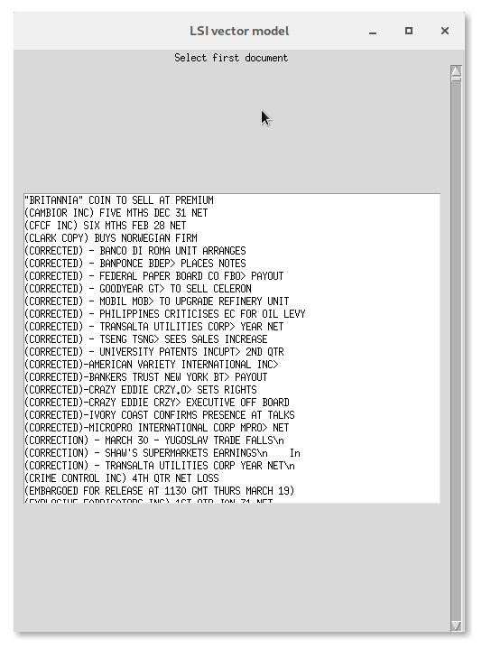

# LSI vektorový model
Semestrální práce na **BI-VWM** LS 2020

**Vypracoval:** *Petr Hasman* a *Tomáš Kalabis*

## Zadání
Cílem projektu je implementace LSI vektorového modelu ukládání dat (tj. poreprocessing a indexování) spolu
s možností dotazování z GUI.

**VSTUP**\
Dotaz – seznam termů spolu s váhami.

**VÝSTUP**\
Seznam databázových dokumentů odpovídající dotazu v klesajícím pořadí podobnosti.

## Popis řešení
Práce se skládá z následujících logických částí:

* Nahrání dat
* Preproccessing dat
  * Lematizace
  * Stemming
* Vytvoření Vektorového Modelu
  * Vytvoření term-by-document matice s prvky jakožto počet výskytů termu *i* v documentu *j*
  * Přidání vah k této matici dle schématu *tf-idf* 
* Vytvoření LSI Modelu
  * Dekompozice term-by-document matice dle SVD
  * Vytvoření concept-by-document matice
* Vytvoření Dotazování
  * dotaz -> dokument
  * dokument do prostoru konceptů
  * zjištění kosinové podobnosti
* Vytvoření GUI pro dotazování
  * Vytvoření uživatelského rozhraní
  * Napojení na dotazování
  
### Nahrání dat
Jako vzorová a testovací data jsme si vybrali zprávy z Reuters (dataset *Reuters-21578*).
Zpráva obsahuje titulek a samotný obsah zprávy (ten bude reprezentovat obsah dokumentu). Zpráv je 21 578.

### Preprocessing dat
Před samotnou implementací bylo třeba upravit obsah dokumentů do vhodné podoby.
Všechna slova (termy) byly lematizovány a stemmatizovány.\
**Lematizace** - odstranění nepotřebných termů (spojky, členy, ...)\
**Stematizace** -  upravení termů na kořeny slov\
Tyto operace zpřesní a zrychlí následný proces implementace.

### Vytvoření Vektorového modelu
Jelikož LSI je téměř nadstavba Vektorového modelu, bylo třeba vytvořit nejprve ten.\
Vytvořila se term-by-document matice obsahující počet výskytů termu *i* v dokumentu *j* iterací přes všechny termy ve všech dokumentech.\
K prvkům této matice je poté třeba přidat jejich váhy. Například některé termy mají malou váhu, jelikož se vyskytují téměř ve všech dokumentech.
Na to jsme využili schéma ***tf-idf***. Výsledkem jse matice **A**\
Jelikož jsou tyto matice velmi velké a řídké, lze výhodně využít vhodných datových typů - invertovaný index, *řídká matice*, ... 

### Vytvoření LSI nadstavby
Pro zohlednění významu slov, synonym, apod. ve vyhledávání se vytvoří concept-by-document matice z původní matice.
Tato matice bude výrazně menší, ale nebude již řídká. Tato matice se vytvoří operací **S * V^T**, kde matice *S* a *V^T* vzniknou z tzv. ***SVD***:

***Singular-Value-Decomposition (SVD)***:\
pro SVD platí ***A = U * S * V^T***
* A - původní matice term-by-document (z Vektorového modelu)
* U - matice obsahující ve sloupcích vlastní vektory matice A * A^T
* V - matice obsahující v řádcích vlastní vektory matice A^T * A
* S - matice obsahující na diagonále vlastní čísla matice A seřazené sestupně 

Pro urychlení se při SVD používá omezení na ***k*** vlastních čísel/vektorů. Hrubě řečeno podobné termy (vyskytující se v podobných dokumentech) se "seskupí" do jednoho konceptu.\
Číslo 1 < *k* < 'nejmenší dimenze matice A'. Čím vyšší je číslo *k*, tím je výsledek přesnější, zato pomalější.
Při určité velikosti *k* je však nárust přesnosti téměř zanedbatelný.\
Číslo *k* jsme odhadli dle experimentů.

### Dotazování
Samotná příprava dotazu je velmi podobná přípravě dokumentu, jelikož dotaz lze chápat jako dokument.
Po zadaní dotazu se nad množinou slov provede lematizace a stemming. Vytvoří se poté term-by-document matice o jednom dokumentu (sloupci).
Poté se opět přídají váhy termů (s ohledem na všechny ostatní dokumenty - na matici *A*).\
Dotaz se poté převede do prostoru konceptů dle vzorce
`qk = S^(-1) * U^T * qt`, kde *qk* je matice dotazu v prostoru konceptů a *qt* matice dotazu v prostoru termů.
Matice *U* a *S* jsou pak z dekompozice SVD.

Poté se již provede porovnání dotazu se všemi dokumenty (v prostoru konceptů) pomoci ***kosínové podobnosti***.
Dokumenty s nejvyšší hodnotou jsou pak nejpodobnější dotazu *q*.
Ty poté seřadíme dle podobnosti a určíme **treshold** (minimální podobnost mezi dokumentem a dotazem).
Výsledná seřazená n-tice poté jde jako výstup.
    
    
## Implementace
Pro implementaci jsme zvolili jazyk *Python* pro jeho jednoduchost, podporu matematických knihoven a možnost vytváření GUI .\
Pro matematické výpočty jsme používali moduly **numpy** a **scipy**, pro práci s daty a preproccessing dat
 moduly **pandas**/**nltk** a pro GUI jsme využili modul **tkinter**.

### Matematické výpočty
Pro práci s maticemi jsme využili *numpy* a *scipy*. Zde se velmi hodila implementovaná knihovna řídké matice - **coo_matrix**.
Využití řídkých matic výrazně urychluje běh programu. Modul numpy se využíval zejména pro husté matice.

### Struktura projektu
* **dataPreparation** package
  * obsahují funkce načítající data (*docLoader.py*) a preprocessing + připravení term-by-document matice frekvence výskytu (*processor.py*)
  
* **lsi** package
  * obsahuje funkce na přidání váh matici (*preparation.py*), vytváření konceptů + SVD (*conceptMatrix.py*) 
  a implementaci dotazování (*querying*)
  
* **reuters21578**, **stopwords**, **cleanDosc** packages
  * obsahují samotná ryzí data + tzv. *stop slova* + zpracovaná data skrz preprocessing

* **data** package
  * obsahuje již vypočítané matice, aby se pokaždém zapnutí programu nemuselo indexovat, ...
  
* mainGuiApp.py
  * Zde je zpracované GUI a spouští celý program
  

## Příklad výstupu
Po spuštění programu (příkaz `python mainGuiApp.py` v kořenovém adresáři) se otevře GUI.
Levé okno zobrazuje na začátku všechny dostupné dokumenty, dle kterých se dá vyhledávat - obsah vybraného dokument tvoří dotaz.

 

Kliknutím na vybraný dokument se provede dotaz.
V levém okně se zobrazí nejvíce podobné dokumenty, v pravém se zoobrazí obsah vybraného dokumentu - dotaz.

Po vybrání dalšího dokumentu se provede předchozí krok.

Tlačítkem `Recalculate LSI` se provede celý proces nahrání dat, preprocessing, indexace a výpočet LSI.
Tlačtkem `back` se program vrátí na výběr ze všech dokumentů.

## Experimenty
Největším problémem při simulaci sekvenčního průchodu byl v algoritmu SVD, který již při 5000 dokumentech
trval velmi dlouho a pro 7000 dokumentů (19549 termů) výpočet SVD trval 14 minut oproti výpočtu s k=50,
kdy výpočet trval 1.1 vteřiny, ale přesnost výsledků nebyla zásadně lepší. Spíše naopak, jelikož kvůli velkému
rozčlenění do mnoha konceptů jsme přisli o schopnost rozpoznávat synonyma. Rozdíl v době trvání samotného
dotazu již nebyl tak razantní (pro k=50 0.05 vteřiny a při sekvenčním průchodu 0.1 vteřiny), tedy přibližně
dvojnásobná délka výpočtu dotazu. Pokud bychom ovšem použili k=1, nedostávali bychom pak vůbec relevantní výsledky.
jelikož by všechny dokumenty byly vyhodnoceny jako podobné. Nejlepších výsledků jsme při experimentování dosahovali 
při nastavení k=250
    
    
## Diskuze
Při práci na semestrálním projektu se nám rozcházely možnosti hardware.
Na prvním počitači indexace a načtení všech dat proběhly relativně rychle, zatímco na druhém výpočet pokaždé zmrazil celý počítač.
Při výpočtu celého modelu LSI je největší problémem využití RAM (pracujeme s velkými maticemim které se načítají do RAM).
Na slabším počítačí (I silnějším pokud byl systém vytížený) program při výpočtu pro všechny dokumenty padal. Dalším omezením je CPU.
Kvůli tomu již program nepadal, ale výpočty jsou náročné a tudíž na méně výkonném hardwaru trvaly dlouho, či vůbec nedoběhly.
Zajímavé by mohlo být pro vělký počet dokumentů a tedy i termů v nich spouštět takové programy v cloudu, s teoreticky neomezenými prostředky.
    

## Závěr
Práce pro nás byla přínosná. Z teoretického hlediska jsme si odnesli příklad použití lineární algebry a vlastních čísel v praxi.
Při implementaci jsme prozkoumali různé možnosti jazyka Python. Celkově pak práce s LSI a její ladění lepšho vyhledávání byla zajímavá.